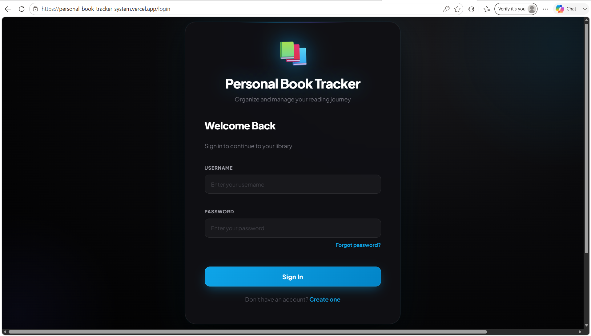
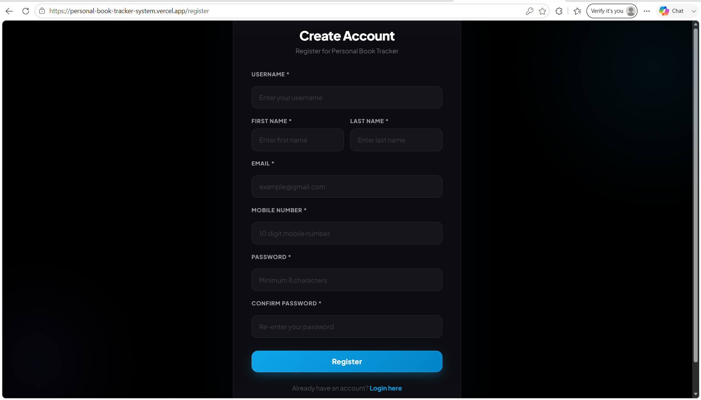
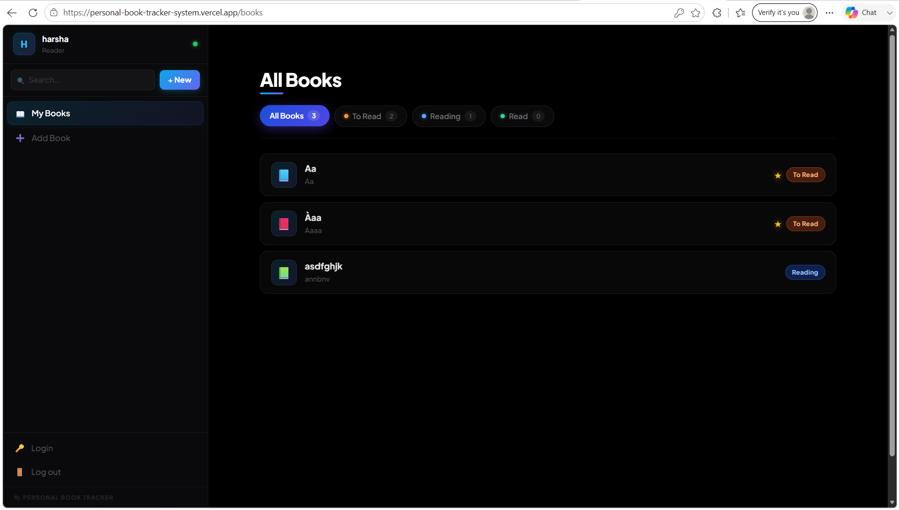
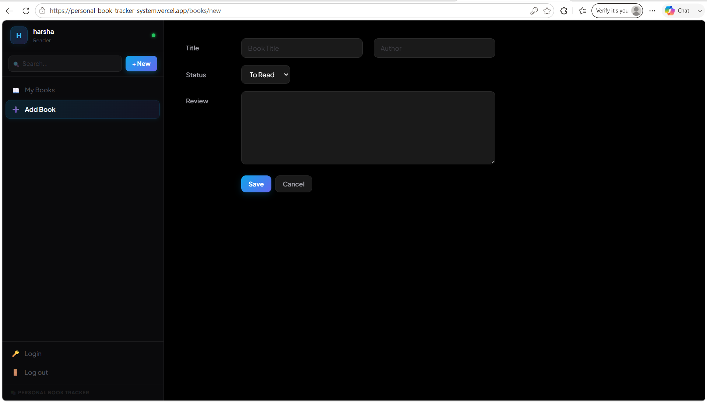
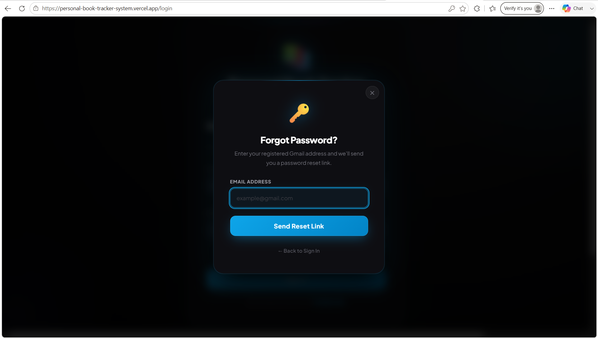

📚 Personal Book Tracker
A full-stack web application to track books you've read, are currently reading, or plan to read — with user authentication, real-time search, and a beautiful dark UI.

## 📸 Screenshots

### Login Page

### Register Page

### Dashboard

### Add Book

### Forgot Password

✨ Features

🔐 User authentication — Register, login, and auto-logout after 2 days

📖 Track books — Add books with title, author, status, and review

⭐ Favourites — Mark books as favourites with one click

🔍 Live search — Search books instantly from the sidebar

📊 Filter by status — Filter by To Read, Reading, or Read

🔑 Forgot password — Reset password via email using Brevo

📱 Fully responsive — Beautiful UI on both mobile and desktop

🌙 Dark mode — Sleek black and blue dark theme throughout

🛠️ Tech Stack
LayerTechFrontendReact, React Router, ViteBackendNode.js, ExpressDatabaseMySQLEmailBrevo HTTP APIAuthJWT (2-day expiry)Deploy (Frontend)VercelDeploy (Backend)Render

🚀 Getting Started
1. Clone the repo
   
git clone https://github.com/H24-D/Personal-Book-Tracker.git

cd Personal-Book-Tracker

2. Install dependencies
   
# Frontend

cd Frontend

npm install

# Backend

cd ../Backend

npm install

3. Set up environment variables
   
Frontend — create Frontend/.env:

VITE_API_BASE=http://localhost:5000/api

Backend — create Backend/.env:

PORT=5000

MYSQL_HOST=localhost

MYSQL_PORT=3306

MYSQL_USER=root

MYSQL_PASSWORD=your_password

MYSQL_DATABASE=booktracker

JWT_SECRET=your_jwt_secret

BREVO_API_KEY=your_brevo_api_key

MAIL_FROM=your_verified_email@gmail.com

FRONTEND_URL=http://localhost:5173

SKIP_DB_CREATE=false

4. Run locally
   
# Start backend

cd Backend

npm run dev

# Start frontend (new terminal)
cd Frontend

npm run dev

🌐 Deployment

ServicePurposeVercelFrontend hostingRenderBackend hostingMySQLDatabase (Clever Cloud)BrevoTransactional email (password reset)

📱 How to Use

Register an account with your Gmail address

Log in — session lasts 2 days then auto-logs out

Add books with title, author, status, and optional review

Mark books as favourite with the ★ button

Filter your list by reading status

Search books instantly from the sidebar

Use Forgot Password to reset via email link

📁 Project Structure

Personal-Book-Tracker/
├── Frontend/                  # React + Vite frontend

│   ├── src/

│   │   ├── auth/

│   │   │   ├── AuthProvider.jsx

│   │   │   └── Protected.jsx

│   │   ├── routes/

│   │   │   ├── login.jsx

│   │   │   ├── Register.jsx

│   │   │   ├── ResetPassword.jsx

│   │   │   ├── root.jsx

│   │   │   ├── books.jsx

│   │   │   ├── book.jsx

│   │   │   └── edit.jsx

│   │   ├── books.css

│   │   ├── index.css

│   │   ├── api.js

│   │   └── main.jsx

│   └── package.json

├── Backend/                   # Node.js + Express backend

│   ├── controllers/

│   │   └── authController.js

│   ├── routes/

│   │   └── authRoutes.js

│   ├── middleware/

│   │   └── auth.js

│   ├── config/

│   │   └── db.js

│   └── server.js

└── README.md

⚠️ Notes

Render free tier spins down after inactivity — first load may take ~50 seconds

JWT tokens expire after 2 days — users are automatically logged out

Password reset links expire after 1 hour

Only Gmail addresses are accepted for registration

🔗 Live Demo
https://personal-book-tracker-system.vercel.app/

📄 License
MIT — feel free to use and modify!
